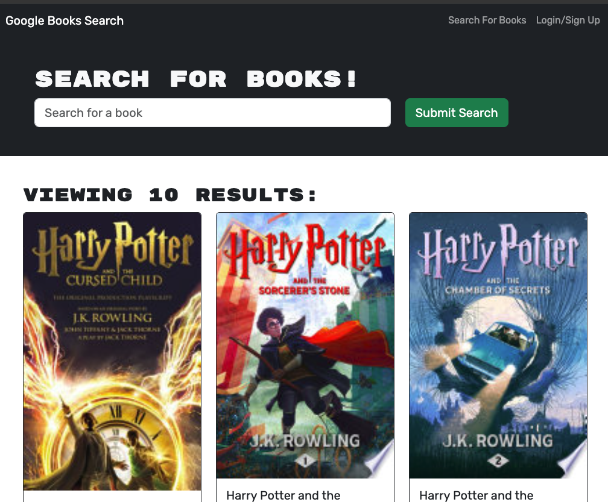
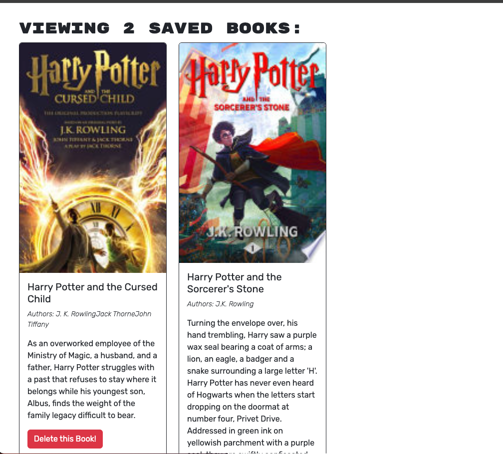

# BOOK-SEARCH-ENGINE

## Discription

This application allows user to search and store books they like too.

## Installation 

N/A

## Usage

Once on the landing page, the user is able to search books right away. If he or she wants to save a book, they must either signup or login and then a button will appear that allows that user to save the book. Once saved you can view all your saved book by clicking on savedBooks. While on that page you have the ability to delete the book from your savedBooks.

[Link to BOOK-Search-ENGINE](https://book-search-engine-k333.onrender.com/)

